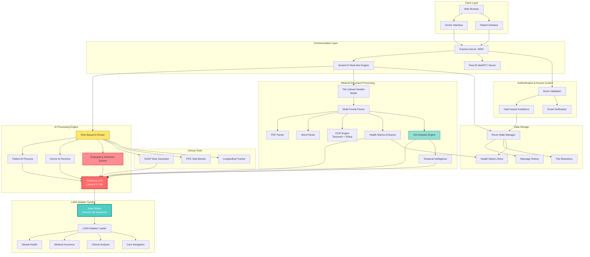

**Demo Video:** [Watch on Google Drive](https://drive.google.com/file/d/1BB1mZT3JOKmFPGYyekpy1WLpaZc3psxi/view?usp=drivesdk)


# 🩺 Arogyamitra — Offline Clinical AI Platform for Hospitals


**Arogyamitra is a healthcare technology startup building safe, offline AI solutions for hospitals — beyond API-calling LLMs.**

Arogyamitra delivers **hospital-grade, on-device AI** that works reliably even without internet connectivity.  
Using **quantized small language models (SLMs)** and **plug-and-play LoRA adapters**, hospitals can instantly add domain-specific AI skills while maintaining privacy, safety, and control.

## 🌟 Overview

Arogyamitra is **not** an API wrapper — it is a fully offline, privacy-first, hospital-grade AI platform designed for real clinical workflows in low-connectivity or air-gapped environments.

## 📚 Table of Contents

- [✨ Key Features](#-key-features)
- [🧠 Core Innovations](#-core-innovations)
- [🏗️ System Architecture](#️-system-architecture)
- [🛠️ Tech Stack](#️-tech-stack)
- [💻 Installation](#-installation)
- [🐳 Docker Deployment](#-docker-deployment)
- [🏁 Vision & Closing](#-vision--closing)

## ✨ Key Features

### 🤖 Offline Clinical AI Core
- Fully offline **on-device inference**
- Fine-tuned **Gemma-1B** (quantized to ~322MB)
- CPU-only execution (no GPU required)
- Works in **airplane mode** or complete network isolation
- No external API dependency → zero cloud risk

### 🔌 LoRA Adapter Marketplace
> *Think of it like an App Store — but for AI skills.*

- Plug-and-play **domain-specific LoRA adapters**
- Swap AI expertise without retraining the base model
- Demo adapters include:
  - 🧠 Mental Health Companion
  - 📄 Medical Insurance Guidance
  - 🏥 Care Pathway & Hospital Navigation
  - 🔬 Clinical Report Analysis

- Developers can upload adapters
- Hospitals buy/download and deploy them **offline**

### 📊 Datasets Used for Demo LoRA Adapter Fine-Tuning

The following publicly available datasets were used to demonstrate fine-tuning of quantized LoRA adapters:

1. **Mental Health Counseling Conversations** (Kaggle)  
   Curated Q&A from online counseling platforms covering diverse mental health topics  
   [Download from Kaggle](https://www.kaggle.com/datasets/melissamonfared/mental-health-counseling-conversations-k)

2. **RaDialog Instruct Dataset**  
   Image-grounded instruct dataset for chest X-ray radiology tasks  
   [Download from PhysioNet](https://physionet.org/content/radialog-instruct-dataset/1.1.0/)

3. **MIMIC-CXR Dataset**  
   Large-scale chest X-ray dataset with de-identified images and radiology reports  
   [Download from PhysioNet](https://physionet.org/content/mimic-cxr/)

4. **MedQuAD (Medical Question Answering Dataset)**  
   High-quality medical Q&A collection from reliable sources (NIH, MedlinePlus)  
   [Download from HuggingFace](https://huggingface.co/datasets/lavita/MedQuAD)

### 💬 Real-Time Doctor–Patient Chat
- Built with **Express + Socket.IO**
- Secure, room-based consultations
- Role-based access:
  - 👤 Patient
  - 👨‍⚕️ Doctor

**Live Features:**
- Join/leave notifications
- Typing indicators
- Chat history sync
- Private AI messages (role-scoped)

### 🧠 Dual-Persona AI Safety Engine

#### 🧍 Patient AI
- Empathetic, reassuring tone
- Simple, non-technical language
- One question at a time
- ❌ **No diagnosis**
- ❌ **No lab interpretation**
- Always encourages doctor review

#### 👨‍⚕️ Doctor AI
- Clinical-grade analysis
- Full medical terminology
- Abnormal value detection
- Evidence-based reasoning

✔ Prevents hallucinations and reduces medico-legal risk

### 📁 Medical File Processing

Supported formats:
- **PDF** — via `pdf-parse`
- **Word** — via `mammoth`
- **Text** — UTF-8
- **Images** — OCR via **Tesseract + Sharp**

**OCR Enhancement Example:**
```javascript
sharp(image)
  .greyscale()
  .normalize()
  .sharpen();


### 🔬 Explainable Medical AI (XAI)

All AI outputs include:
- Clinical summary  
- Critical findings  
- Normal range → current value → deviation %  
- Step-by-step reasoning  
- Confidence score  
- Immediate concerns  
- Recommendations  

### 🕐 Temporal Health Intelligence

- Longitudinal report comparison  
- Trend detection  
- Early warning signals  
- Deterioration / improvement analysis  

### 🚨 Emergency Detection & Escalation

- Keyword detection (chest pain, breathlessness, stroke, seizure, suicide, etc.)

**AI Triage Output (example):**
```json
{
  "level": "CRITICAL | HIGH | MODERATE | LOW",
  "reasoning": "...",
  "urgentAdvice": "..."
}
```

**Automatic escalation:**
- Immediate patient guidance
- Private doctor alerts
- Normal AI flow is paused during emergencies

### 📋 Doctor Co-Pilot
- Automatic SOAP note generation
- Uses:
  - Chat history
  - Uploaded reports
  - AI insights
- Saves 10–15 minutes per consultation

### 📷 Webcam-Based Vital Monitoring (PPG)
- Uses remote photoplethysmography (rPPG)
- Estimates:
  - Heart rate
  - Breathing rate
  - Stress indicators
- Non-contact, no wearables needed
- Runs inside chat via AI tool calls

## 🧠 Core Innovations

1. **Offline-first hospital AI**
2. **Modular LoRA skill system**
3. **Demo fine-tuning on public datasets**
4. **Role-based AI isolation** (patient vs. doctor personas)
5. **Explainable and auditable outputs**
6. **Privacy-by-design architecture**

## 🏗️ System Architecture



## 🛠️ Tech Stack

### Backend
- **Node.js** + **Express** — Server framework
- **Socket.IO** — Real-time bidirectional communication
- **PeerJS** — WebRTC signaling for video calls
- **Multer** — File upload middleware

### AI & ML
- **LangChain** + **ChatGroq** — LLM orchestration
- **Llama-3.3-70B-Versatile** — Production LLM
- **Gemma-1B (Quantized)** — Offline inference model
- **LoRA Adapters** — Domain-specific skills

### Document Processing
- **pdf-parse** — PDF text extraction
- **mammoth** — Word document parsing
- **Tesseract.js** — OCR engine
- **Sharp** — Image preprocessing

### Frontend
- **HTML5/CSS3/JavaScript** — Core web technologies
- **Socket.IO Client** — Real-time updates
- **PeerJS Client** — WebRTC video/audio

## 💻 Installation

### Prerequisites
```bash
- Node.js >= 16.x
- npm or yarn
- Tesseract OCR binary (for image processing)
```

### Setup Steps

1. **Clone the repository**
```bash
git clone https://github.com/yourusername/arogyamitra.git
cd arogyamitra
```

2. **Install dependencies**
```bash
npm install
```

3. **Environment Configuration**
Create a `.env` file:
```env
PORT=9000
GROQ_API_KEY=your_groq_api_key_here
DOCTOR_EMAIL=your_doctor_email@example.com
```

4. **Create required directories**
```bash
mkdir uploads
mkdir public
```

5. **Start the server**
```bash
npm start
```

6. **Access the application**
```
http://localhost:9000
```

## 🐳 Docker Deployment

### Using Docker Compose

```yaml
version: '3.8'
services:
  arogyamitra:
    build: .
    ports:
      - "9000:9000"
    environment:
      - GROQ_API_KEY=${GROQ_API_KEY}
      - DOCTOR_EMAIL=${DOCTOR_EMAIL}
    volumes:
      - ./uploads:/app/uploads
      - ./models:/app/models
    restart: unless-stopped
```

### Build and Run
```bash
docker-compose up -d
```

## 📡 API Endpoints

### Room Management
- `POST /api/create-room` — Create consultation room (Doctor only)
- `POST /api/validate-room` — Validate room access
- `GET /api/doctor-rooms` — Get doctor's active rooms

### File Operations
- `POST /upload` — Upload medical files with AI analysis

## 🔐 Security Features

1. **Hash-based Room Invitations** — Secure, single-use links
2. **Email Verification** — Role-based access control
3. **Role Isolation** — Separate AI personas for patient/doctor
4. **Private Messages** — Role-scoped AI responses
5. **No Data Leakage** — Patient never sees clinical analysis

## 🎯 Usage Flow

### For Doctors:
1. Create room with patient email
2. Share secure invitation link
3. Wait for patient to join
4. Start video consultation (optional)
5. Review AI-analyzed reports
6. Generate SOAP notes
7. End session

### For Patients:
1. Receive invitation link
2. Join room with email verification
3. Upload medical reports
4. Chat with doctor
5. Ask AI (patient-safe responses)
6. Receive prescriptions/advice

## 🚀 Roadmap

- [ ] Multi-language support (Hindi, Tamil, Bengali)
- [ ] Offline LoRA adapter marketplace
- [ ] Mobile app (React Native)
- [ ] Integration with HIS/EMR systems
- [ ] Blockchain-based medical records
- [ ] Advanced PPG vitals monitoring

## 🏁 Vision & Closing

Arogyamitra aims to democratize clinical AI for hospitals in low-connectivity regions while maintaining the highest standards of privacy, safety, and explainability. Unlike cloud-based API wrappers, our offline-first architecture ensures:

✅ Zero data leakage  
✅ Complete privacy control  
✅ No vendor lock-in  
✅ Works in air-gapped environments  
✅ Modular skill system via LoRA adapters  

**Demo Video:** [Watch on Google Drive](https://drive.google.com/file/d/1BB1mZT3JOKmFPGYyekpy1WLpaZc3psxi/view?usp=drivesdk)

---

**Built with ❤️ for healthcare providers worldwide**

## 📄 License

MIT License - See LICENSE file for details


---

*Arogyamitra - Bringing AI to healthcare, offline and on-device.*
```
